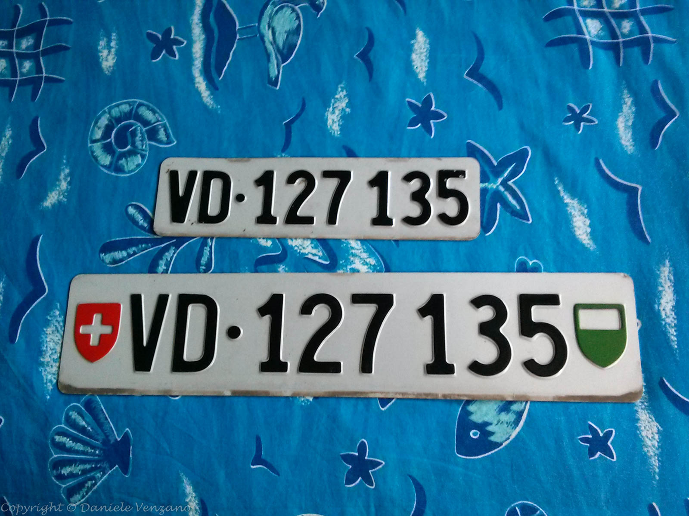

## La vera cuciniera Genovese (2016-04-25)

Grazie ai [Distributed Proofreaders](http://www.pgdp.net/) sono riuscito a preservare un vecchio libro che girava per casa, con pagine ormai ingiallite, strappate, tenuto insieme con lo spago. Ora è disponibile per tutti, nel pubblico dominio, in vari formati digitali, su [Project Gutenberg](http://www.gutenberg.org/):

[http://www.gutenberg.org/ebooks/51857](http://www.gutenberg.org/ebooks/51857)

Si tratta di una raccolta di ricette di inizio '900. Ci sono piatti di tutti i tipi, dolci e salati, oltre che conserve, gelati e liquori. Certi ingredienti sono un po' difficili da trovare e alcuni attrezzi da cucina non esistono più se non in qualche piccolo museo di campagna, però ho già provato diverse ricette e sono venute buone buone :)

Datevi alla VERA cucina genovese!

## Ciao ciao targhe Svizzere (2013-07-23)

Con queste targhe sono andato fino ad Oslo e ritorno, ho fatto quasi 30,000km in Svizzera, Italia, Francia, Germania, Danimarca, Svezia e Norvegia. Con loro ho incontrato una ragazza meravigliosa e ho fatto tante amicizie, ho traslocato tutte le mie cose dalla Svizzera sotto il naso delle guardie di frontiera e ho preso tre multe, tutte in Francia, tutte per aver superato di qualche chilometro all'ora il limite di velocità.

Sono parte della mia storia e se potessi tenerle, lo farei... Ma no, domani andrò all'ufficio postale e le spedirò. Servono a qualcun altro.

A te, perfetto sconosciuto del canton Vaud, che avrai le mie targhe per la tua macchina nuova di zecca, buona fortuna, fanne buon uso e stai attento ai limiti di velocità in Francia.

## Dogane francesi (2013-07-16)

L'ufficio delle dogane francesi a Nizza si trova all'aeroporto, nella zona Cargo. È sufficiente seguire i cartelli 'cargo', lasciare un documento all'ingresso (non la carta d'identità, che serve dopo) e salire al primo piano, seguendo questa passerella che vedete nella foto.

Si può andare lì per tutto, non solo per merci arrivate via aerea, ma anche per animali esotici, quadri o come nel mio caso, automobili.

## L'ultima notte in Svizzera (2013-01-30)

La vista dall'hotel, la mia ultima notte in Svizzera, prima di completare il trasloco in Francia. Un bel ricordo.

Esattamente due anni dopo essere arrivato in Svizzera, la lascio, per trasferimi in Costa Azzurra, dove ho accettato di lavorare come ingegnere di ricerca nel [Distributed Systems Group](http://distsysgroup.wordpress.com) presso [Eurecom](http://www.eurecom.fr). Lavorerò su problemi di cloud, big data e IaaS, volendo usare un po' di gergo simil-tecnico e sufficientemente vago.

Perché lascio la Svizzera e uno stipendio d'oro? Il contratto del professore a capo del mio gruppo di ricerca all'EPFL non è stato rinnovato e tutti quanti siamo rimasti a piedi. Il piccolo dettaglio che il mio capo avesse un contratto a tempo determinato è stato omesso al momento della mia assunzione, avendomi assicurato invece 5 anni di lavoro.

## Casa dolce casa (2011-01-08)

Dopo una rapida escursione a Losanna di due giorni (ed una notte), son tornato giù con due contratti firmati ed un po' di documentazione varia.

Intanto ho una casa, un piccolo monolocale con vista sul lago, un po' caro forse, ma a stress zero. Potrò andare a lavorare a piedi e nell'affitto sono compresi tutti i servizi e le bollette (persino luce, tv via cavo ed Internet). Per ora il contratto l'ho fatto per due mesi, ma è rinnovabile e conto di rimanere lì per un po', a meno di non scoprire qualche orribile difetto. Il proprietario, una signora che si occupa anche del ristorante al piano terra, non ha voluto garanzie di nessun tipo. L'affitto si paga in anticipo, ci sono 500,- CHF di caparra per eventuali danni e 200,- CHF di pulizia finale, quando si lascia l'alloggio definitivamente.
Non ha fatto storie per vedere contratti di lavoro, permessi di soggiorno, lettere di referenza o altro, come vogliono altri.
Per uno che si trasferisce dall'estero è impossibile fornire quei documenti se non dopo un po' che si trova sul posto e quindi, o si dorme sotto un ponte, o si cerca di affittare da qualcuno con un po' di sale in zucca.

Subito dopo sono andato in comune, a 200 metri dalla casa, per chiedere informazioni per il permesso di soggiorno (ora che ho un indirizzo postale svizzero posso chiederlo). Una signora gentile si è sforzata di capire il mio francese e mi ha spiegato come funziona, confermando quello che [avevo letto](http://www.bfm.admin.ch/content/bfm/it/home/themen/aufenthalt/eu_efta/ausweis_b_eu_efta.html) su Internet. Mi ha lasciato i suoi contatti diretti nel caso avessi altre domande ed un foglio con le [caratteristiche richieste per la foto](http://www.eda.admin.ch/etc/medialib/downloads/edactr/usa/embwas/WASCOA.Par.0046.File.tmp/Schengen_Photo%20requirements.pdf).
La domanda vera e propria la farò tramite l'[EPFL](http://www.epfl.ch/index.en.html) i primi giorni di Febbraio, quando effettivamente mi trasferirò su.

Infine sono andato all'ufficio personale dell'EPFL per firmare il contratto di lavoro. Dopo un momento di panico hanno capito cosa volevo da loro e hanno recuperato i documenti. Le persone che se ne sono occupate erano in ferie e hanno dovuto scartabellare un po'. Mi avevano mandato già tutto per posta prima di Natale, ma non avevo mai ricevuto nulla. Quando gliel'ho detto, mi hanno risposto: "Sì, è un problema che abbiamo spesso con l'Italia". Evvai.

In realtà ci ho messo poco più di un'ora a fare tutto e quindi mi son scoppiato 9 ore di macchina, tra andata e ritorno per così poco. Però son contento e ora posso rilassarmi. So che ho una casa, cosa c'è dentro (e quindi cosa mi devo portare il giorno del trasloco), ho in mano il contratto di lavoro (che male non fa) e so esattamente cosa devo fare il primo giorno in cui sarò in Svizzera: fare domanda per il permesso di soggiorno e con il foglio temporaneo che mi daranno, andare alla banca per aprire un conto.

## Svizzera, arrivo! (2010-12-16)

Dopo aver passato una selezione decisamente più difficile del previsto, ho accettato l'offerta di lavoro presso l'[EPFL](http://www.epfl.ch/) (École polytechnique fédérale de Lausanne), al [Networked Systems Laboratory](https://infoscience.epfl.ch/collection/Infoscience/Research/IC/IINFCOM/NSL?ln=en). Dal primo di febbraio, giorno più, giorno meno, mi trasferisco con armi e bagagli a
[Losanna](http://www.openstreetmap.org/#map=12/46.5266/6.6309), con un cambio di vita e lavoro di cui sto prendendo coscienza pian piano. Il passo è grande, ma come si suol dire: "Hai voluto la bicicletta? Adesso pedali!".

Il primo, e forse più grosso, scoglio è trovare casa. A Losanna ci sono pochi appartamenti ammobiliati disponibili per l'affitto in questo momento. Inoltre cercar casa su Internet è molto comodo, grazie anche a street view, ma non è come essere sul posto ed andare a vedere direttamente. Sicuramente sarà necessario prendere una soluzione temporanea per poi darsi da fare sul posto.

Una volta che ho un tetto sopra la testa, il resto mi sembra persino banale in confronto. Un po' di burocrazia per ottenere il permesso di lavoro (di tipo 'B', mi raccomando), la ricerca di un'assicurazione medica e altra robetta del genere.

## Addio a RockFM (2008-05-30)

Domani sera, alle 18, RockFM terminerà le trasmissioni.

È qualcosa che mi lascia davvero un vuoto. Anni fa, ho comprato una radio apposta per poter ascoltare le sue trasmissioni in camera mia quando volevo. Quando ho comprato la prima macchina, il tasto '1' dell'autoradio è andato subito su RockFM. Quando ho cambiato auto, ho comprato immediatamente l'autoradio e me la sono montata da solo per poter continuare ad ascoltare RockFM.
RockFM mi ha accompagnato per migliaia di chilometri (e centinaia di ore di coda) in giro per Genova, al mattino andando in università prima e al lavoro adesso, e alla sera tornando a casa.
Sono arrivato al punto in cui so in che zone della città si prende bene e in quali si prende male.

RockFM faceva poca pubblicità, che non mi ha mai disturbato e tantissima musica, non solo hard rock. I DJ erano bravi e avevano piena libertà, e si sentiva. C'erano trasmissioni per tutti i gusti, sempre curate e divertenti, davvero un intrattenimento di classe.

Detto in parole povere, come RockFM non ce n'è, niente alternative. Spesso ho fatto zapping radiofonico, rischiando di tamponare qualcuno, cercando una radio che facesse buona musica. Mai trovato niente, sempre un brano qui, una canzone là, saltando da una frequenza all'altra.

Un po' più di un'ora fa è iniziata la trasmissione conclusiva di 24 ore, se potete ascoltatela, a Genova sugli 87.550 o 87.750.

Per tutti quelli interessati a sentire come si è arrivati qui, ecco il [discorso di addio a radio RockFM del DJ Faulisi](/download/discorsofaulisi.mp3). La comunità che si è formata dietro a RockFM si è raccolta su [RockFamily.it](http://www.rockfamily.it "RockFamily"), dove in tanti sperano in  un miracolo di qualche tipo...

Per quanto mi riguarda, se ne va il 95% della radiofonia italiana, sto già rispolverando il mio CD riscrivibile pieno di MP3, in previsione di tanta coda in macchina e poca radio...

## OLS - Ottawa Linux Symposium (2007-07-07)

Sono tornato da qualche giorno dal Canada ed è tempo di fare un po' il sunto di quello quello che ho visto. Era il mio primo viaggio oltreoceano ed è stata un'esperienza molto molto interessante. Per cominciare devo dare atto all'Air France, ho volato bene, con ottimi pasti e gentili hostess, tutto in orario e nessun problema di bagagli o coincidenze.

La conferenza si è svolta per quattro giorni presso l'[Ottawa Conference Centre](http://www.openstreetmap.org/way/264535169#map=16/45.4257/-75.6901), da mercoledì a sabato, con orari molto prolungati, dalle 9 (o 10) fino alle 20, con diverse pause. Un giorno siamo arrivati alle 21 grazie ad un incontro non previsto su Linux Embedded. Non sto a contare i party che si sono svolti e che si sono prolungati fino a notte fonda, con birra a fiumi e (purtroppo) roba da mangiare abbastanza scadente.

Un dato di fatto è che lo sviluppo di Linux è gestito sempre di più da dipendenti di grandi aziende come IBM, Intel, HP, Freescale e Red Hat. Queste aziende sviluppano più del 50% delle modifiche fatte ad ogni release del kernel. Finché in cima c'è Torvalds e Morton, che non lavorano per nessuna grossa compagnia, non c'è nulla da temere, in quanto sono loro che decidono cosa va bene e cosa no e hanno un buon potere di controllo. La situazione attuale, in effetti, è ottimale: le aziende ci mettono la manodopera e gli obiettivi concreti (e ci fanno parecchi soldi) e la Comunità ci mette il potere di controllo, l'innovazione e quel po' di chaos necessario all'avanzamento del progetto sul lungo periodo. Finché questa situazione di equilibrio permane, Linux continuerà a crescere ai livelli attuali, mangiando fette di mercato un po' a tutti gli altri.

Tra le altre cose interessanti che ho sentito (ma ci sono in giro per la rete delle cronache molto più dettagliate di questa) c'è il fatto che finalmente qualcuno presso Red Hat ha deciso di mettere mano al gran casino che è l'audio su Linux: tra esound, alsa, oss, jack, arts e altri non ci si capisce più nulla, e soprattutto cercare di fare una chiamata voip mentre si ascolta della musica è praticamente impossibile a causa dei conflitti di volumi e mixing tra le varie librerie.

(Nota dal 2016: pulseaudio sembra che inizi a funzionare a dovere, ma me ne tengo ancora lontano)

Infine ci sono novità interessanti nel campo del USB senza fili (un bluetooth con gli steroidi) e del read ahead, per rendere ancora più furbe le letture da disco fisso. Alcune notizie interessanti ci sono state per l'embedded. Parecchia gente sta lavorando con Linux su sistemi piccoli, portatili e facili da usare. C'è molto lavoro in corso nel campo del risparmio energetico e nella gestione furba dei dispositivi tipici dei sistemi embedded (memoria flash, batterie, piccoli lcd).

In ogni caso, evviva il Canada ;-)

## Primo giorno di lavoro (2006-05-02)

Oggi ho iniziato il lavoro "vero". Orario d'ufficio, mensa aziendale, casini con le timbrature per l'orario e tanta, tanta allegria (?). Mi hanno assegnato una bestia di computer, che domani dovrò finire di domare: Pentium 4 HT, SATA, bla bla.

Ci devo lavorare con Linux, ma Ubuntu non vede la scheda audio e bisogna utilizzare il SAK per sbloccarla al boot, mentre Debian non vede la scheda di rete e non si installa neanche. A tutto ciò si somma il problema di dover anche concludere del lavoro 'vero'...

La soluzione che ho trovato è intermedia: uso Ubuntu e intanto installo la Debian in un'altra partizione, attraverso debootstrap+chroot. Domani (forse) mi basta caricare a mano il modulo sky2 per la scheda di rete, ma più probabilmente dovrò compilarci il kernel 2.6.16.

Il lavoro, almeno per le prossime due settimane, consisterà in gran parte nel continuare quello che avevo fatto nella tesi di laurea con le reti wireless, ma poi si dovrebbe allargare per comprendere anche sviluppo su architettura ARM. Pare che mi aspettino anche un po' di trasferte.

Chi vivrà vedrà...

## Non più Svezia... (2005-12-01)

È da un po' che non scrivo più sul blog e sono stato prontamente richiamato all'ordine dai miei accaniti lettori. Abdul è sicuramente avido di notizie riguardo ad un (piccolo) incidente che mi è successo mentre ero su in Svezia, ma non ho intenzione di divulgare nient'altro oltre quello che già sta circolando: ho preso una botta in testa, ho fatto una visita al pronto soccorso di Uppsala e ho fatto la conoscenza di una tirocinante/dottoressa chiamata Linda, molto carina e gentile, che forse mi è rimasta impressa anche per lo stato un po' confusionale in cui ero in quel momento. Molti, molti medici dovrebbero prendere lezioni da lei su come trattare con i pazienti...

Completato questo dovere di cronaca, passiamo ad altro. Nei 10 giorni in cui sono stato in Svezia ho visitato Uppsala e ho fatto una tessera da 'studente settimanale' per entrare nei locali solo per studenti, che rimpiango di non aver sfruttato adeguatamente, non tanto per il costo irrisorio della suddetta tessera, ma per l'ambiente molto molto bello.
Casino, ma a livelli accettabili, luci soft e molte candele sui tavoli, mangiare e bere buono e a prezzi contenuti.

Un giorno sono anche andato a Stoccolma, provando il brivido del treno svedese e del freddo pungente che penetra dentro qualunque imbottitura dopo un'intera giornata all'aperto. Città molto bella, piena di fantastici panorami grazie al sole basso e ai tanti bracci di mare, isole e ponti sui quali è costruita.

Ma, cosa più importante di tutte, sono andato su per rilassarmi e ci sono riuscito. Uppsala è una città che si presta bene per farsi delle gran passeggiate e il freddo (niente di speciale, solo un giorno siamo arrivati a -6°) non mi spaventa più di tanto, anzi bisogna stare attenti a non coprirsi troppo perché camminando ci si scalda ed è meglio non mettersi a sudare.
Insomma, alla fine posso dare un bilancio più che positivo all'esperienza svedese.

*And lots of thanks to Lina, Fra and the girls of my corridor at building 11, Studentstaden, Uppsala.*

## Svezia! (2005-11-13)

Ora che sono diventato un Dottore in Informatica, mi sono preso un po' di meritato riposo. Seguendo le tracce di [chi](http://dreadnaut.altervista.org/) ormai ha fatto del viaggio in Svezia una scienza esatta (tranne che per i ritardi degli aerei), mi sono diretto a Uppsala per un po' di giorni di riposo, meditazione e bei paesaggi.

A causa di un guasto Ryanair ha dovuto far arrivare un nuovo aereo dall'Inghilterra, causando un paio d'ore di ritardo, una perdita a catena di coincidenze ed un guadagno netto per le compagnie telefoniche e petrolifere di due nazioni (ebbene sì, sono tutti d'accordo contro di noi). Alla fine tra una cosa e l'altra siamo arrivati con una sola ora di ritardo rispetto al previsto (pur sempre le 5 del mattino, però...) perché ci sono venuti a prendere in macchina a Stoccolma.

Qui a Uppsala ho una stanza in un quartiere di monolocali per studenti, con bagno privato e cucina comune. Molto tranquilla, molto bella e dato che non ci sono mobili, anche molto spaziosa :-)

Stasera ho mangiato una 'pizza' (per mancanza di un nome migliore) con tzatziki, feta, olive nere, peperoni, cipolla, pezzi di carne e fette pomodori chiamata 'Stavros'.

Buona, anche se sto bevendo ancora adesso per cercare di farmi passare questa sete micidiale che mi è rimasta...

## Tesi di laurea (2005)

Ho raccolto quello che ho scritto ai tempi in una [diario dedicato](/about/diario-di-laurea).

## Chiusura della mailing list di Zena su initd.org (2004-10-28)

Ieri sera tardi ho chiuso la lista del Gruppo Zena, di cui ero il moderatore.
È un altro capitolo che si chiude in un lungo elenco, sembra che Linux a Genova riesca sempre a tirar fuori il peggio delle persone, causando conflitti e scontri su argomenti in gran parte irrilevanti.
Dopo esser stato tra i fondatori del LUGGe, del GeLUG e del Gruppo Zena, ogni gruppo con sempre meno regole e sempre più ristretto, è arrivato il momento in cui dico basta e mi occupo di altro nella vita. Una parte del gruppo continuerà a portare avanti le attività sotto il nome di Zena, a loro auguro una buona continuazione.