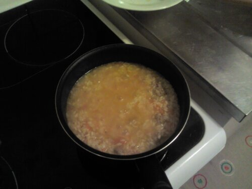

## Stasera risotto

Zucca e salsiccia con un fiore di zucchine per guarnire...

## Muffin!

Muffin ai lamponi e cioccolato bianco, finalmente son lievitati giusti.

## Zucchette ripiene

Il ripieno è a base di carne tritata, con uova per tenerlo insieme, aromi, cipolla e un po' di parmigiano.

## Biscotti

Pasta frolla e gocce di cioccolato.

## Torta verdurosa

Per sfruttare un avanzo di coste di bietola e un po’ di zucca, ho provato a fare una torta bicolore. La ricotta è straordinariamente difficile da trovare qui a Losanna, però sono riuscito a procurarmene due confezioni di contrabbando, prodotta in Germania.

Un giorno che vado in centro a Losanna mi devo ricordare di andare ad esplorare un nuovo negozio chiamato “Formaggeria Italiana” che si trova da qualche parte in Rue du Tunnel. Visto il nome, si spera abbiano formaggi freschi come stracchino, ricotta e robiola che al supermercato sono introvabili.

Al gusto non è venuta malissimo. Il ripieno mancava di sale, la parte con le bietole piangeva la mancanza di maggiorana e noce moscata. Sulla pasta ho parecchio spazio di miglioramento. Creare uno spazio dove spianarla potrebbe già essere un bel passo avanti.

## Plumcake

Per difendermi un po’ dal freddo che nei giorni scorsi mi assediava, ho provato a fare il plumcake con la marmellata.

L’ho cotto un filo di troppo e quindi non è rimasto umido in mezzo, come dovrebbe essere, inoltre questa era la ricetta senza yogurt, quindi magari doveva venire così di natura.

Per le marmellate ho usato un set di 6 marmellatine monodose tipo albergo che ho trovato alla coop.

## Focaccia

Un sacco di olio e di ore di lievitatura, ma che soddisfazione avere la focaccia fragrante così lontano da Genova!

## Raclette time

Un po' fuori stagione, ma un ottimo modo per scaldarsi dopo un inaspettato tuffo in un gelido torrente.
