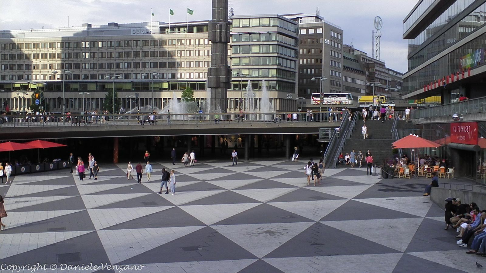
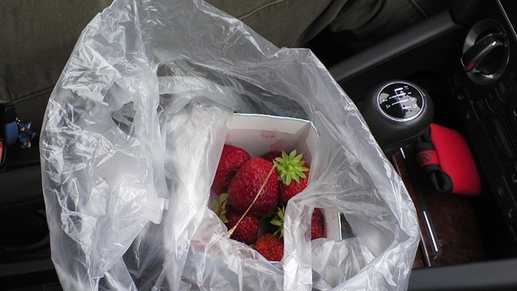

La prima parte del viaggio si fa tra Losanna e Oslo, in auto. Attraverseremo la Germania, la Danimarca e la Svezia, facendo soste a Copenhagen e Stoccolma. Una volta giunti ad Oslo prenderemo l'aereo per Tromsø, da dove, con auto a noleggio, proseguiremo per Capo Nord. Dato che Nordkapp è un posto molto turistico e costoso abbiamo programmato di andare a Knivskjellodden, che si trova sul promotorio affianco e 1,5Km più a nord.

## Il profondo nord (giorno 1, 2012-07-06)

Oggi partenza per un lungo e complicato viaggio al nord. Vacanze vere, per una volta, con amici, la macchina e la tenda, che alla fine useremo solo un paio di notti.

È un giorno di viaggio. Una volta usciti dalla Svizzera abbiamo iniziato ad incontrare parecchio traffico, dopo Basilea. Arrivati ad un posto chiamato Bühl ci siamo chiesti se avevano spostato la capitale della Germania, vista al quantità di mezzi e persone in movimento su strade ed autostrade.

Lungo la strada ci fermiamo ad [Heidelberg](http://it.wikipedia.org/wiki/Heidelberg), per una sosta tecnica e turistica. In coda in una stradina nel centro storico siamo stati ad aspettare davanti ad una pasticceria che ci chiamava tentandoci in tutti i modi.

Per la sera avevamo programmato un campeggio, ma dato che non eravamo sicuri di quando saremmo arrivati, né se l'avremmo trovato, avevamo preso anche l'indirizzo di un ostello a Göttingen.

Tutto è andato per il meglio e siamo arrivati in tempo per la nostra esperienza in tenda. Il [campeggio](http://www.openstreetmap.org/?lat=51.52023&lon=9.69156&zoom=16&layers=C "Campingplatz Am Niemetal") si trova vicino in una valletta un po' umida, con un ruscello e tanti moscerini. A parte questo (per fortuna non erano zanzare), il campeggio è molto bello e ben attrezzato. Il piccolo ristorante annesso al campeggio ci ha fornito un'ottima cena e una abbondante colazione.

Vicino all'edificio principale ci sono un po' di animali: delle galline ed una capretta. Questa capretta mi è sembrata un po' strana, probabilmente si trovava a disagio nelle dolci colline tedesche e aveva la tendenza a cercare sempre di arrampicarsi sopra a qualcosa. Nella foto l'ho ritratta sopra ad un ceppo, ma l'abbiamo vista anche sopra oggetti molto più alti, ferma lì a guardarci e a belare ogni tanto.

Latitudine: 51º 31' 11.79''

## Arrivo a Copenhagen (giorno 2, 2012-07-07)

Dato che mi sono svegliato presto, sono andato a fare una passeggiata nel bosco per vedere cosa c'è in cima alla collina sopra al campeggio. Nessuna sorpresa purtroppo, campi coltivati e in lontananza pale eoliche, esattamente come avevamo visto per ore ed ore dall'autostrada il giorno prima.

Prima di partire facciamo il punto. Oggi si inizia a fare qualcosa di interessante, abbiamo un traghetto da prendere, tra Puttgarden e Rødby! Prima di arrivarci, però, ci toccano tante altre lunghe ore di macchina. A Copenhagen ci aspetterà il nostro amico Roberto, che ha coperto in un paio d'ore di aereo quello che noi abbiamo fatto ieri in una giornata di macchina. La differenza fondamentale sarà che noi abbiamo potuto portarci dietro il bagnoschiuma e tutte le bottiglie d'acqua che potevamo desiderare.

Dopo la pasticceria del giorno prima è rimasta la voglia e quindi ci procuriamo dei *pain au chocolat* in un forno di un paesino vicino al campeggio. Una fornaia un po’ pazza, ma molto simpatica, ha voluto vendercene ben 5 per solo un 1 euro e mezzo. Visti i prezzi bassissimi anche al supermercato poco dopo, ho seriamente pensato se andare a vivere lì.

Come il giorno prima, altro traffico e code ogni 20Km. Hanno deciso di riasfaltare tutte le autostrade, tutte nello stesso momento. Facciamo una sosta a Hildesheim, dove visitiamo il centro storico, che è stato ricostruito interamente dopo la seconda guerra mondiale, e il chiostro della cattedrale, dove si trova un roseto centenario.

L'imbarco sul traghetto è molto efficiente e non ci sono tempi di attesa: si paga il pedaggio (con una signorina che aiuta ad infilare la carta di credito nella macchinetta, per evitare intoppi) e ci si imbarca subito.

L'ora e mezza di autostrada per Copenhagen è piuttosto monotona, altre pale eoliche, a centinaia, e poco altro.

Arrivati a Copenhagen la monotonia viene sostituita da un labirinto di sensi unici intorno al Tivoli: un'esperienza stimolante, che però non rifarei una seconda volta.

Camera in [ostello](http://www.openstreetmap.org/?lat=55.675839&lon=12.574318&zoom=18&layers=C "Danhostel Copenhagen downtown") piccola, ma simpatica. Pochi bagni però, infatti al mattino dopo era difficile trovare un posto libero.

Il nostro amico è già sul posto, facciamo cena ed una passeggiata in una zona del centro che non conoscevo ancora prima di andare a dormire.

Latitudine: 55°40′34″N

## Il giorno del Ponte (giorno 3, 2012-07-08)

Oggi visita a Copenhagen, sirenetta, palazzo reale, cose così. Ci ero già stato nel 2008 e non è che fossi rimasto molto colpito.

D'estate c'è più vita per le strade, la zona pedonale è simpatica e accogliente, mentre intorno al Tivoli l'atmosfera è confusa e soffocante, a causa anche dei cantieri. Tanti, tanti lavori in corso per la metropolitana, che finiranno chissà quando. In generale non ho cambiato idea: la città è carina, ma incasinata. Siamo saliti anche in cima alla spira della [Vor Frelsers Kirke](http://www.vorfrelserskirke.dk/italiano), da dove si gode una bella vista su tutta la città.

Nel pomeriggio siamo partiti verso la Svezia, via [ponte sullo stretto Øresund](http://it.wikipedia.org/wiki/Ponte_di_%C3%98resund). Il ponte è fantastico, attraversarlo è emozionante, più per il pensiero della traversata che per la vista, un po' limitata dalle alte barriere, probabilmente contro il vento.

Sulla via ci siamo fermati a Lund, dove ero già stato, sempre nel 2008. Abbiamo fatto un breve giro turistico, comprensivo di un buon gelato. Spesa all'IKA per i giorni successivi.

E poi, corsa fino al [campeggio](http://www.grannacamping.se/) a Gränna. Siamo stati un po' stressati dall'orario del campeggio, che alle 23 ci avrebbe chiuso fuori. Lungo la strada abbiamo cenato presso un fast-food in una stazione di servizio e poi abbiamo assistito ad un fantastico tramonto sul lago. Purtroppo non ho foto, dato che stavo guidando, ma non credo avrebbero reso a sufficienza.

Latitudine: 58°01'36"N

## Stoccolma (giorno 4, 2012-07-09)

Il risveglio è piuttosto umido, il prato su cui abbiamo piantato la tenda è carico d'acqua. Una rapida colazione e poi passiamo a visitare la roccia runica di [Rök](https://it.wikipedia.org/wiki/Pietra_runica_di_R%C3%B6k), prima di tornare in autostrada.

A pranzo ci fermiamo a costruire dei panini in un parco pubblico a Linköping, cercavamo il centro, ma dopo un po' di sbagli ci siamo persi e abbiamo deciso che alla fine un posto valeva l'altro.

L'ingresso a Stoccolma in auto non è dei più semplici, ma è solo un assaggio rispetto alle fantasie stradali di Oslo e Tromsø. L'autostrada passa sotto la città ed una serie di tunnel laterali che spuntano dal nulla in mezzo ai palazzi permettono di entrare ed uscire. Per fortuna ho riconosciuto qualche nome sui cartelli e siamo usciti al posto giusto.

A Stoccolma, gran sole e solo qualche goccia di pioggia. L'ingresso in città è a pagamento, ma non per le auto straniere. Ci dirigiamo subito all'[ostello](http://www.svenskaturistforeningen.se/en/Discover-Sweden/Facilities-and-activities/Stockholm/Vandrarhem/STF-Hostel-af-Chapman--Skeppsholmen/) a mollare la macchina, poi andiamo in giro per la città a piedi. In due conosciamo bene la città e facciamo da ciceroni al terzo. Visita obbligata al negozio di materiale sci-fi, per una volta che non ho limiti di bagaglio, entro con la sensazione che avrei potuto svuotato il reparto libri, ma alla fine ho comprato solo due libri. Dato che mi sono rimaste un sacco di corone svedesi mi sa che tornerò più preparato.

Alla sera c'è ancora un sacco di luce, iniziamo ad apprezzare che stiamo viaggiando verso nord. Una mongolfiera fa capolino tra i palazzi.

Latitudine: 59° 19' 58.0372"

## Stoccolma e Uppsala (giorno 5, 2012-07-10)

Al mattino facciamo una gita ad Uppsala, dove Francesco mi ha fatto [scoprire la Svezia](/eventi-storici#svezia-2005-11-13) nel lontano 2005. Dall'ultima volta che ci sono stato, Uppsala non è cambiata di una virgola. La stazione è stata rinnovata ed ora è diventata un ristorante, lasciando l'ingresso ai treni in un edificio accanto, di vetro, che sembra un centro commerciale. Di certo non saremo gli unici a rimanere un po' confusi.

Il pomeriggio e la sera li passiamo ancora a passeggiare per Stoccolma. A fine giornata ci raggiunge un'amica di Francesco, che ci fa da guida in una zona che conoscevo poco, a Södermalm. Ci porta lungo una passeggiata molto simpatica da cui si vede tutta la città, che provvediamo ad aggiungere alle tappe dei nostri futuri viaggi a Stoccolma.

## Oslo (giorno 6, 2012-07-11)

Oggi si fa Stoccolma - Oslo, passando dal [lago Vänern](http://it.wikipedia.org/wiki/V%C3%A4nern), il più grosso di Svezia. Cercheremo di trovare un equilibrio tra il fermarci lungo la strada e l'arrivare ad Oslo in tempo per girare un po' la città, dato che il giorno dopo ci aspetta l'aereo in mattinata.

La strada tra Stoccolma e Oslo è di una monotonia impressionante. Alberi, alberi ed ancora alberi. Il confine con la Norvegia non è segnalato in modo particolare, c'è uno spiazzo dove i doganieri fanno i loro controlli, ma niente cartelli o indicazioni particolari. Anche nei giorni successivi abbiamo continuato a notare una certa riluttanza a mettere segnali e cartelli comprensibili ai turisti.

Lungo al strada, per spezzare un po' la monotonia, facciamo una sosta a [Örebro](http://it.wikipedia.org/wiki/%C3%96rebro) ed una a [Karlstad](http://it.wikipedia.org/wiki/Karlstad_(Svezia)) per comprare delle ottime fragole svedesi (e un po’ di altre vettovaglie, dato che i prezzi in Norvegia sono molto più alti).

Arriviamo a Oslo in tempo utile per prendere la camera in ostello e uscire a fare due passi prima di cena. Il sistema stradale è complesso e la segnaletica piuttosto scarsa. Giusto per fare un esempio, ecco [la doppia rotatoria](http://www.openstreetmap.org/?lat=59.91076&lon=10.76165&zoom=16&layers=C), **una sopra l'altra**. Mi sembra di capire che le città scandinave stanno facendo a gara a chi riesce a far impazzire i navigatori GPS nel modo più rapido e completo possibile.

In città ci incontriamo con la quarta componente del gruppetto, Manuela, che ha deciso di unirsi a noi per il salto oltre il circolo polare artico. Lei ha trovato una camera tramite Couchsurfing e la sua ospite ci accompagna lungo la strada principale del centro, facendo quattro chiacchiere.

Tutta la zona vicino al mare intorno all'Opera House è coperta da lavori in corso. Stanno rifacendo il sistema stradale, speriamo in meglio, inoltre hanno in costruzione diversi piccoli grattacieli, sicuramente di grande valore architettonico, ma decisamente brutti.

Manca un po' l'accesso al mare, il porto commerciale si trova proprio di fronte al centro, con banchine e piazzali di carico e scarico, che limitano la vita della città più in centro, tra i palazzi. La città era anche più sporca di come me l'aspettavo.

Latitudine: 59° 56′ 58″ N

## Tromsø (giorno 7, 2012-07-12)

Oggi si vola con Norwegian fino a Tromsø. Abbiamo prenotato i posti dal lato giusto dell'aereo per vedere i fiordi, sperando nel bel tempo, che però non c'è. Vediamo tante nuvole e qui e là qualche sprazzo poco rassicurante di neve e ghiacciai.

L'aereo è sorprendentemente economico per essere la Norvegia e in un paio d'ore ci porta a *soli* 550 chilometri dalla nostra destinazione finale.

Appena arrivati carichiamo tutto sull'auto a noleggio e ci dirigiamo in centro, per far riparare una valigia danneggiata e cercare qualcosa per cena, con l'idea di viaggiare senza soste fino ad [Alta](http://www.openstreetmap.org/#map=12/69.9670/23.2124). Da oggi in poi non ci dobbiamo più preoccupare che venga notte, perché ci sarà sempre luce, infatti è il periodo giusto per il sole di mezzanotte!

In un altro esempio di fantasia stradale norvegese, tra l'aeroporto e il centro di Trmosø, incontriamo le nostre prime rotonde sotterranee, scavate nella roccia sotto la città. La qualità dei cartelli rimane scarsina, scritte piccole e poco comprensibili. Il GPS sotto terra non funziona e dobbiamo affidarci al nostro istinto.

Alla fine restiamo a Tromsø più tempo del previsto e partiamo dopo le 6 del pomeriggio. La strada ha dei pezzi con panorami spettacolari, ma consiglio vivamente di prendere i traghetti per attraversare i fiordi subito a nord di Tromsø. La luce bassa e calda della sera aiuta parecchio a rendere i panorami ancora più piacevoli. C'è tanto sole e fa caldo, siamo sopra il circolo polare e stiamo in maniche corte! Sulle pendici dei fiordi si vede però della neve.

Lungo la strada ci fermiamo all'1 di notte a fotografare il sole di mezzanotte (c'è l'ora legale) e poco dopo arriviamo al campeggio di Alta.

Latitudine: 69°58'01' N

## Knivkjellodden (giorno 8, 2012-07-13)

Partiamo un po' più tardi, i nostri orari sono ormai legati più ai tempi e alle distanze che ad un regolare ritmo sonno/veglia. Lungo la strada passiamo su un altipiano, tra due fiordi, con la strada dritta che si perde all'infinito. Poco oltre incontriamo un gruppo di renne, che pascolano lungo la strada.

Un'altra giornata di tempo stupendo, sui 20 gradi, soleggiata. Incontriamo decine e decine di bus turistici, roulotte e camper. L'attività turistica è frenetica e prendiamo atto che l'arrivare a Capo Nord coi mezzi più strani è diventato ormai piuttosto inflazionato: ci sono tricicli, tandem, motociclette che trainano minuscole roulotte.

Dopo cinque ore di macchina in totale arriviamo a Honningsvåg intorno alle 16, il paese prima di Capo Nord. Prendiamo le camere nel campeggio/ostello (ben tenuto, economico e dotato di efficiente connessione ad Internet) e, pieni di energie e forti del bel tempo e delle temperature mite, decidiamo di fare l'escursione di circa 5 ore A/R verso un punto più a nord di Capo Nord.

L'inizio del sentiero per [Knivskjellodden](http://en.wikipedia.org/wiki/Knivskjellodden) si trova poco prima della barriera di pedaggio per Nordkapp. La camminata è molto lunga, 18Km andata e ritorno, ma praticamente in piano. Qualche tratto sassoso e fangoso ripaga abbondantemente lo sforzo di essersi portati gli scarponcini da montagna fin quassù. Il sole è caldo e non ci abbandona mai, l'aria invece diventa un po' tagliente e sul ritorno fa un po più freddo.

Il sentiero arriva sulla punta del promontorio, ben 1,5 Km più a Nord di Nordkapp, dal quale possiamo sbeffeggiare i turisti che hanno pagato fior fiore di quattrini per andare in un posto che non ha niente di speciale, dato che non è il più a nord d'Europa. *O meglio è il punto più a nord raggiungibile comodamente seduti in macchina...*



Per quanto stancante, è una camminata fantastica. Siamo stati molto fortunati a trovare il sole caldo e pochissime nuvole. È evidente, dalle rocce e dagli oggetti scagliati dal mare sulla costa, che quando il tempo è brutto lì, lo è davvero.

Ritorniamo in ostello verso le tre di notte, gli orari ormai completamente scombussolati, ci facciamo una bella pastasciutta. Io e Francesco la condiamo con un barattolo di pesto alla genovese procurato in Svezia, provocando orrore e sconforto nei nostri due amici, che optano per un tradizionale barattolo di salsa all'arrabbiata della Barilla. Il pesto non è poi così male e andiamo a dormire contenti e soddisfatti.

Latitudine: 71° 11' 08" N

## Ritorno a Tromsø (giorno 9, 2012-07-14)

Il tempo si mette al nuvoloso e poi inizia anche a piovere. Ci fermiamo un attimo per recuperare l'asciugamano di Roberto, dimenticato su una spiaggia il giorno prima all'andata e ancora lì, appeso all'albero dove l'avevamo lasciato. Dobbiamo tornare a Tromsø in una tirata unica.

La strada è la stessa dell'andata, ci mettiamo 10 ore, con il brutto tempo che finalmente è arrivato. Un sacco di pioggia, stanchezza e noia. Avendo perso il traghetto l'abbiamo fatta lungo la costa, allungando di parecchio i tempi. Consiglio il traghetto, decisamente.

In Norvegia constatiamo anche che la tecnologia che noi abbiamo dai tempi dei romani di costruire strade che scaricano l'acqua sui lati quando piove, non è mai arrivata. L'acqua anzi si raccoglie nei due incavi formati dal passaggio delle ruote, proprio dove l'effetto è più pericoloso.

Arrivati finalmente a Tromsø, ci concediamo una bella e sontuosa cena in un ristorante del centro. Prendo un piatto con una bistecca di renna, buonissima!

## Oslo, il ritorno (giorno 10, 2012-07-15)

La compagnia si divide. C'è chi, da Tromsø, prende un altro aereo per raggiungere la fidanzata. Gli altri, me compreso, prendono l'aereo per Oslo, da dove Roberto e Manuela prendono l'aereo per l'Italia.



Recuperiamo la mia auto nel parcheggio dell'aeroporto ad Oslo, accompagno gli altri all'altro aeroporto, Torp, e poi verifico che l'imbarco del traghetto fosse davvero dove dice Google. Concludo la giornata con un giro in centro, cercando di spendere le poche corone norvegesi che mi erano rimaste.

## Traghetto per la Germania (giorno 11, 2012-07-16)

Visto che sono da solo, per tagliare un po' della lunga strada di ritorno verso casa, ho prenotato un traghetto per Kiel, in Germania. Il viaggio dura 20 ore e l'arrivo è previsto alle 10 del giorno dopo. Il traghetto è grosso e assomiglia ad una nave da crociera in maniera preoccupante.



Sono un po' preoccupato perché non so come funziona l'imbarco, in mano ho solo la stampa di un email in italiano che conferma la prenotazione. In ogni caso, partenza alle 12. Una volta arrivato sul posto, mi rendo conto che ero io che mi facevo dei problemi.
All'imbarco, dopo uno sguardo confuso all'email in italiano, l'addetta ha preso il passaporto e cercato la prenotazione col nome. Punto negativo per la Color Lines: obbligano a presentarsi due ore prima e non si può più uscire dalla zona d'imbarco, per fortuna avevo da leggere, se no la noia mi avrebbe sopraffatto.



Una volta salito a bordo, esploro la nave. È grande e bella, ma tutto è studiato per obbligare i passeggeri a spendere e consumare. All'interno non ci sono posti a sedere liberi, si trovano tutti in bar e ristoranti. Mi sono attrezzato con giaccone e berretto e mi sono sistemato fuori, con un libro. Il vento, i gabbiani e i bambini che giocavano col vento fortissimo mi tengono compagnia. Ho visto il primo tramonto in 4 giorni, sul mare.

I sacchettini bianchi posti ovunque nei corridoi erano un segnale significativo, infatti per qualche ora la nave ha attraversato una zona aperta e c'è stato mare molto mosso. Temevo di soffrire, invece ho mangiato un enorme piatto di spaghetti bolognese, tenendo fermo il bicchiere di barbera con una mano. Ho voluto fare l'esperimento del ristorante italiano sul traghetto Oslo -- Kiel, temevo peggio, invece mi hanno messo solo un po' di insalata sopra agli spaghetti.

## Sulla via del ritorno (giorno 12, 2012-07-17)



Sbarco dal traghetto alle 10. Faccio benzina e poi mi butto in autostrada. Verso le 15 arriva un colpo di sonno e mi fermo a dormire in un'area di sosta. Verso le 18 inizio a chiedermi se fare una tiratona unica ed arrivare a casa a notte fonda o fermarmi da qualche parte a dormire. Non avendo fatto piani sono un po' incerto. Esco dall'autostrada e seguo le strade normali, avendo deciso di fermarmi se avessi visto un posto che mi ispirava.

A un certo punto vedo un cartello per Würzburg, che già conosco per precedenti lavorativi. So dove dormire, dove mangiare. Decido di fermarmi lì. Finalmente l'ho vista col sole e ho capito come è fatta, dato che in trasferta non c'è mai stato molto tempo per il turismo. Cena in birreria lussuosa, per meno di quello che è costata la colazione (pane e marmellata) sul traghetto.

## Ritorno a casa (giorno 13, 2012-07-18)

Dopo altre n ore di Autobahn abbastanza interminabili, sono arrivato a casa. Pare sia esplosa la fogna nel parcheggio, ma grazie all'efficenza Svizzera, sono arrivato che stavano già chiudendo il buco nella strada. E ora sotto col bucato!

## Impressioni (2012-07-19)

Per prima cosa, l’organizzazione è andata benissimo. Eravamo in quattro, ognuno che arrivava da un posto diverso dell'Europa, con esigenze e tempi diversi. L’idea di organizzare tutto con un documento condiviso via Internet è stata brillante, tutti sapevano tutto, non ci sono state incomprensioni o sorprese. Anche il lavoro di prenotazione, un po’ estenuante, ha pagato bene. Anche se arrivavamo tardi, sapevamo di avere un letto e/o un tetto che ci aspettava e quanto sarebbe costato.

Non abbiamo fatto molto bene i conti con il traffico o le condizioni della strada. Le tappe in auto sono state molto più lunghe e pesanti del previsto.

Attraversare la Germania in auto è pesante. Le autobahn scorrono via veloci (quando non c'è coda), ma sono interminabili.

Per quanto riguarda i paesi scandinavi, bisogna studiare le cartine e in particolare i nomi delle strade ed autostrade. I cartelli sono in genere poco significativi se non si conoscono i luoghi e le strade sono indicate con la nomenclatura europea (tipo E6), con una N o S per indicare la direzione.

A Stoccolma e Oslo è meglio prepararsi e non fare affidamento sul GPS, entrambe le città hanno un vasto sistema di tunnel per ridurre il traffico in superficie.

In Norvegia è molto facile trovare campeggi e forse non è necessario prenotare tutto come abbiamo fatto noi. Al ritorno però abbiamo apprezzato di aver preso il bungalow, quando piove, piove e in tenda sarebbe stato miserabile, soprattutto dopo 10 ore di auto. Parecchi campeggi non si trovano su Internet, ma ci sono. Forse dovevamo guardare siti specializzati.

Con i tempi che ci siamo dati non c’era da fare molto di diverso, se non prendere treni ed aerei al posto dell’auto. Avendo un po’ più di giorni, avrei forse fatto tappe più brevi, con soste un po’ più prolungate. Sono tutte strade bellissime, in Germania (lavori in corso a parte), in Svezia e Norvegia, con bei paesaggi e natura rigogliosa, ma alla lunga stancano.

Lo rifarei? Certo che sì!
